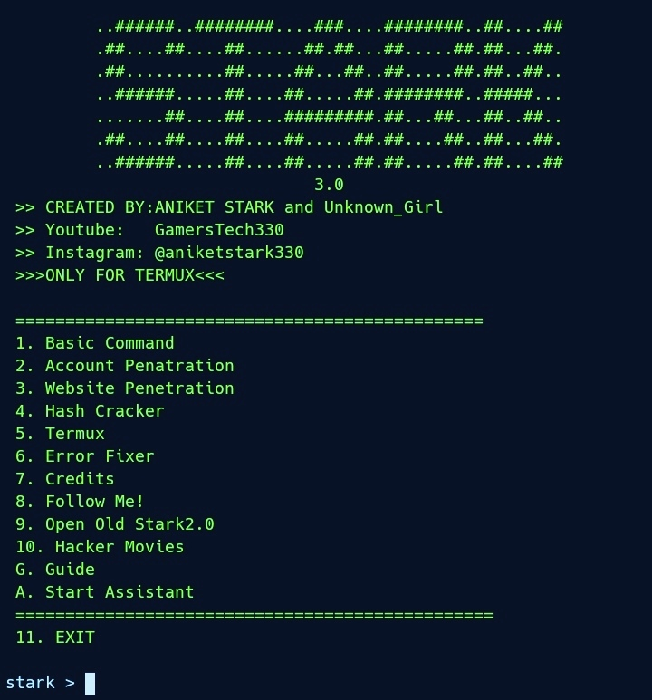

IN THIS SCRIPT INCLUDES SOME SCRIPTS WHICH IS NOT CREATED BY ME
I DONT TAKE RESPONSIBLITY OF ANY MISUSED

Now in this script available some basic to advance features
like
1.  Information gathering tools
2. ph!sh!ng tools
3. create payload
4. port forwarding (http, tcp)
5. sql dorking
6. md5 or more hash decryption (comming soon..)
7. capture photo (back front)
8. battery information (with health, temperature, more.,)
9. text to speak (offline)
10. flash light (bruh😂 noob)
11. Guide Section
12. DDOS Attack
13. website admin page finder

And Maybe More Find me If you CaN.......

cd STARK3.0

bash install.sh

python2 stark.py

IMAGES

Credits
1. SHELLPHISH =====> https://github.com/thelinuxchoice/shellphish
2. BLACKEYE   =====> https://github.com/thelinuxchoice/blackeye
3. WEEMAN     =====> https://github.com/evait-security/weeman
4. INURLBR    =====> https://github.com/googleinurl/SCANNER-INURLBR
5. HULK       =====> https://github.com/grafov/hulk
6. GOLDERNEYE =====> https://github.com/jseidl/GoldenEye
7. TORSHAMMER =====> https://github.com/dotfighter/torshammer Real Owner THELINUXCHOICE
8. HASHER     =====> https://github.com/CiKu370/hasher
9. RED_HAWK   =====> https://github.com/Tuhinshubhra/RED_HAWK
10. HASH-BUSTER=====> https://github.com/s0md3v/Hash-Buster 
11. Breacher  ======> https://github.com/s0md3v/Breacher 
